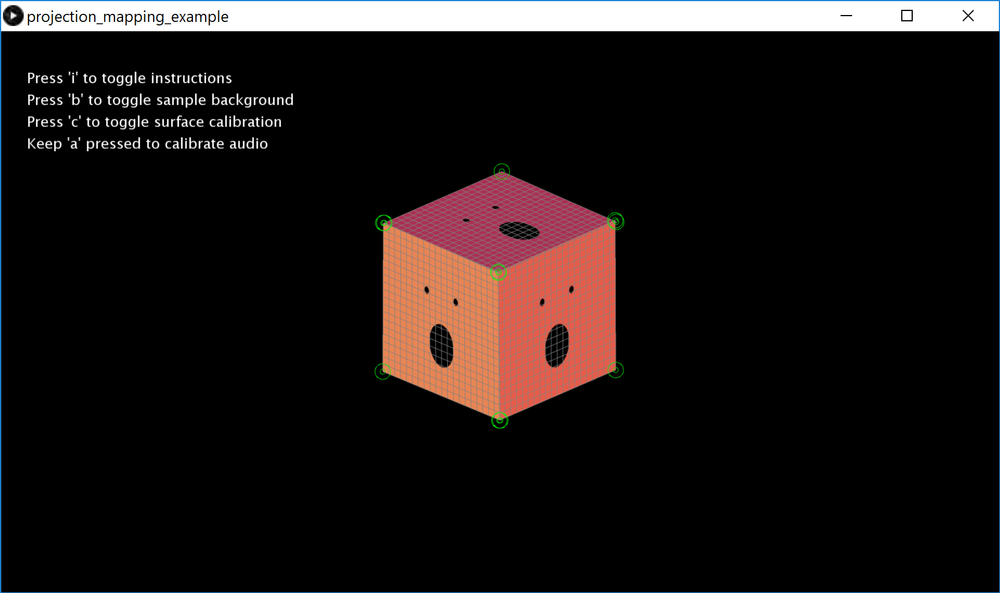

# Audio Responsive Projection Mapping

This is a small example I put together to show how to use the [Keystone](https://fh-potsdam.github.io/doing-projection-mapping/processing-keystone/) library to do projection mapping in [Processing](https://processing.org/). The faces react to the volume of the input sound.

Make sure you have both the [Sound](https://processing.org/reference/libraries/sound/) library and the [Keystone](https://fh-potsdam.github.io/doing-projection-mapping/processing-keystone/) library installed before you run the sketch.

The idea for this project comes from this YouTube video by Chris Rojas: https://www.youtube.com/watch?v=EwrNMhCm5_Q